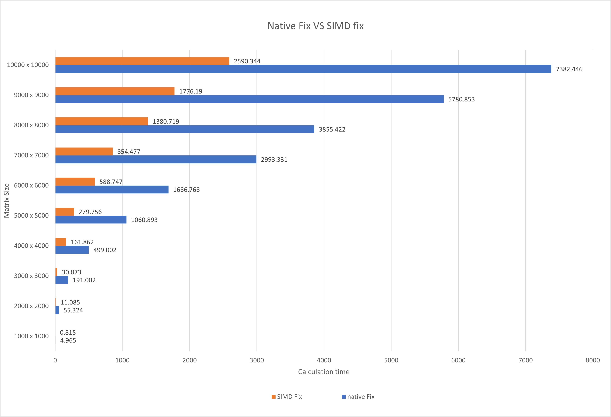

# ACS-project1
## Overview
In this Project, the team write codes to compare native way of Matrix Multiplication with SIMD Matrix Multiplication for both 2-byte fixed point data and 4-byte floating point data. After testing with data size range from 1000 to 10000, the team find out that with the help of SIMD and cache optimization, the calculation time reduce significantly. 

## SIMD
Single instruction, multiple data(SIMD) is a class of parallel computers in Flynn's taxonomy. It shows that computers with multiple processing element taht perform the smae operation on multiple data points simultanesously. SIMD is extremly applicatble to common tasks like digital image adjusting or digital audio adjusting. Nowadays, most CPU designs include SIMD instructions to improve the performance of multimedia usage.

## Cache Optimization
Nowadays, normal memory speed has not kept pace with that of processors. The performance boost for CPU is about 50% annually while for memory only 10% annually. Based on the fact of speed mismatch. The idea of cache optimization arise. The logic was that to make often used data stay in the fast cache memory that the processor need not frequently go back to main memory for it 

## Coding structure
The project is written on C and is comprised of 1 test.c file for running and 2 helper files including predefined functions for different cases.

## Compiling & Running

In order to run the project, you can use the following command to compile the test.c code.  
#### gcc -Wall -mavx2(This command is used to enable SIMD) -o test.o test.c helper.c  
#### ./test.o

## User Interface

Once you run the test.o file, the program in the terminal will ask you questions about the mode you want for testing, the first question it will ask is **whether you want native mode or SIMD mode**. You can enter **1 or 2** to choose the mode. The second question it will ask is **whether you want fixed point or floating point**. After you choose the correct type of mode/data, the program will process you to enter the **row/column number for matrix 1 and matrix 2** respectively.

## Matrix Multiplication
### Native Multiplication
The logic of native multiplication is go through each row and column for both matrix, multiply the single value in corresponding row in matrix1 and column in matrix 2 and sum up the products to get a result for a specific location in output matrix.  
The following codes shows function for the native short multiplication.  
``` 

void Multiply_short(short** m1,short **m2, short **result, int row1, int col1, int row2, int col2){

	for(int i =0; i< row1; i++){
		for (int j=0; j<col2; j++){
			result[i][j] = 0;
			for(int k=0; k<col1;k++){
				result[i][j] += m1[i][k]*m2[k][j];
			}
		}
	}
}

```

### SIMD Multiplication
The logic of SIMD multiplication is to load 16/8 short int/float into the  `__256m` structure which can store 256 bit value. Then by using Intel's high-performance Advanced Vector Extentions(AVX) SIMD instructions. The program can proform 16/8 multiplication at the same time and store the result into another `__256m` structure. In this way the calculation speed can be reduced significantly. Moreover, in order to optimize the cache optimization, the team load and store a single value of matrix1 16/8 times into a `__256m` structure to make the value stay in the cache to increase the hit rate for this repeated used data. Morever, in order to further increase the calculation speed, the team use the strategy of unrolling.  
The following codes shows the function for short SIMD multiplication.
```

void Multiply_short_SIMD(short** m1,short **m2, short **result, int row1, int col1, int row2, int col2){

	for(int i =0; i< row1; i++){
		for (int j=0; j<col2; j+=32){
			__m256i sum1 = _mm256_setzero_si256();
			__m256i sum2 = _mm256_setzero_si256();
			for(int k = 0; k< col1; k++){
				__m256i m1_value = _mm256_set1_epi16(m1[i][k]);
				__m256i m2_value1 = _mm256_loadu_si256((__m256i*)&m2[k][j]);
				__m256i m2_value2 = _mm256_loadu_si256((__m256i*)&m2[k][j+16]);
				__m256i product1 = _mm256_mullo_epi16(m1_value, m2_value1);
				__m256i product2 = _mm256_mullo_epi16(m1_value, m2_value2);
				sum1 = _mm256_add_epi16(sum1, product1);
				sum2 = _mm256_add_epi16(sum2, product2);

			}	

			_mm256_storeu_si256((__m256i*)&result[i][j], sum1);
			_mm256_storeu_si256((__m256i*)&result[i][j+16], sum2);
		}
	}
}

```


## Testing Hardware 
* i7-8700K Boost to 4.7GHz
* GTX 1080
* 32G DDR4 Memory
* Windows 10 64 bit


## Testing Result in Table
all calculating time measure in seconds 

|matrix size  |native Fix|   SIMD Fix   |native Float|SIMD Float|
|-------------|----------|--------------|------------|----------|
|1000 x 1000  |	    4.965|	   0.815|	6.303|     0.791|
|2000 x 2000  |	   55.324|	  11.085|      66.811|    13.891|
|3000 x 3000  |	  191.002|	  30.873|     242.099|    66.698|
|4000 x 4000  |	  499.002|       161.862|     710.898|   169.826|
|5000 x 5000  |  1060.893|       279.756|    1053.444|   177.089|
|6000 x 6000  |  1686.768|       588.747|    1820.053|   289.079|
|7000 x 7000  |	 2993.331|       854.477|    2991.452|   607.056|
|8000 x 8000  |	 3855.422|      1380.719|    4116.431|   902.848|
|9000 x 9000  |  5780.853|      1776.190|    6342.021|  1295.968|
|10000 x 10000|  7382.446|      2590.344|    9634.913|  2112.581|





## Conclusion
In conclusion, from our testing result we can clearly tell that for Matrix multiplication, with the help of SIMD, the speed of the calculation time increase significantly for both fixed and floating data type. While considering the calculation speed for the 2 data types, we can tell from our experiment results that native fixed point multiplication takes less time than the native floating point matrix multiplication while SIMD floating point multiplication takes similar or less(for large testing size) time than the SIMD fixed point matrix multiplication.
