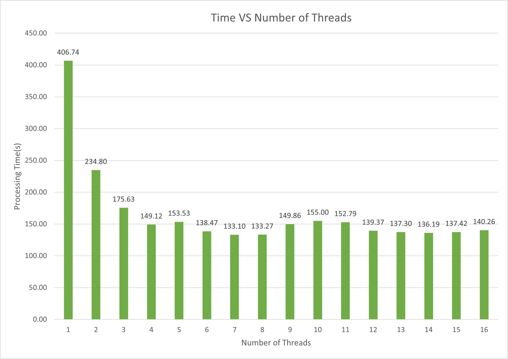

# ACS-project2
## Overview
In this project, the team write code to read 4KB blocks from a file and try to use the strategy of multitreading to compressed each 4k file block with the help of zlib and write each compressed file block into a output file in sequence. After testing with the input data size of 10GB file, the team find out that with the help of multithreading, the compression time can resuce significantly.S

## Pthread
In nowadays shared memory multiprocessor architectures, parallelism can be achieved by using threads. In the past, hardware vendors always implemented their own proprietary versions of threads while in recent years, there is a standardized C language threads programming interface was created: POSIX threads, or Pthreads.


## Coding Structure
The project is written in C language and is comprised of 1 single compression.c file.

## Compiling & Running

In order to run the project, you can use the following command to compile the compile the compression.c code.
#### gcc -Wall compression.c -lz -pthread
#### ./a.out input.txt(The input file name) output.txt(The output file name) record.txt(The record file record compressed length for each 4k block)
#### ex: ./a.out test2 test2_1 record_1

## User Interface

Once you run the a.out file, the program will first check if you enter enough arguments on to the terminal, if the program detects **that you do not enter enough file information**, it will exit and return a error message. Once the argument detection is passed. The program will try to open the input file with the given file name. If the program detect **the input file cannot be open**, the program will exit and return a error message. After finish these checkes, the program will ask you a question **Inter the amount of thread you want to use (Enter a value from 1 to 16)** and you can enter a number range from 0 to 16. After you finish the entry, the program will check if entered number is in the defined range and if the program detects that **you do not enter appropriate thread number**, it will exit and return a error message.

## Code Description
### Struct   \_thread_data
The struct of the core of the program, for this struct as we can see from the below code, we have 2 char arrays called uncompress[BLock_SIZE+1] and compress[BLOCK_SIZE_COMPRESS_LIMIT]. The uncompress will store the 4kB data read from the input file while the compress array will store the compressed data that will be written to the output file.
```
struct _thread_data{
	int thread_id;
	char uncompress[BLOCK_SIZE+1] ;
	uLong ucompsize;
	uLong compsize;
	char compress[BLOCK_SIZE_COMPRESS_LIMIT];
};

```
### void \*CompressionWork
The function is actually working function that each thread will use to do the compression job. it will take a void* thread_argv as the input and it will point to a actual \_thread_data structure. In the function, a array called compressed_output will been created to store the compressed value after calling the compress2 function in zlib. And finally, the data in compressed_output will been copy to the compress char in the \_thread_data struct.
```
void *CompressionWork(void * thread_argv){


	struct _thread_data * thread_data;
	thread_data = (struct _thread_data *) thread_argv;

	//printf("Come Here1\n" );
			
	char compressed_output[thread_data->ucompsize];

	//printf("After Here2\n");

	compress2((Bytef *)compressed_output, &thread_data->compsize, (Bytef *)thread_data->uncompress, thread_data->ucompsize, Z_BEST_COMPRESSION );
	strcpy(thread_data->compress, compressed_output);


	pthread_exit(NULL);
}

```
### int read_file_blocks
This function will be used to read several blocks of 4kB data onto a 2 D array structure called blocks based on the thread_num. From the below code we can tell, the function will called a for loop based on the thread_num. In each for loop, the function will try to read 4096 Byte data onto the blocks[i] array and if the function read the end of the file, it will return 1 to remind the main function. A int pointer blocks_count will be used to record the actual Bytes read to help to handle the compression of very last part of the input file(Eg: for a 4 threads operation, for the last read operation it only reads in 5099 Bytes data which means for the last round thread operation, only 2 thread is needed for the compression and 1 is allocate with 4096 Byte data while the other is only allocate with 1003 Byte data)
```

int read_file_blocks(char blocks[][BLOCK_SIZE+1], int thread_num, FILE * ptr, int * blocks_count){
	*blocks_count = 0;
	for(int i=0; i< thread_num; i++){
		memset(blocks[i],0,sizeof(blocks[i]));

		int temp;
		temp = fread(blocks[i], sizeof(char), BLOCK_SIZE, ptr);	
		if(temp != BLOCK_SIZE){

			blocks[i][temp]='\0'; 
			*blocks_count = *blocks_count + temp;
			return 1;
		}

		*blocks_count = *blocks_count+ temp;
		
		 blocks[i][temp]='\0'; 
	}


	return 0;
}

```

## Testing Hardware
i7-6700HQ  
GTX 980M  
16G DDR4 Memory  
Ubuntu 20.04


## Experimental results



## Conclusion
In conclusion, from our testing results, we can easily tell that multithreading will largely improve the speed of the compression work for large size input files. However, if we blindly increase the number of threads executing together, the cost for thread resource competing will influence the efficiency.


